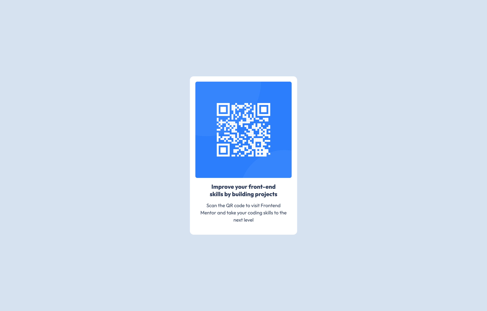

# Frontend Mentor - QR code component solution

This is a solution to the [QR code component challenge on Frontend Mentor](https://www.frontendmentor.io/challenges/qr-code-component-iux_sIO_H). Frontend Mentor challenges help you improve your coding skills by building realistic projects. 

## Table of contents

- [Overview](#overview)
  - [Screenshot](#screenshot)
  - [Links](#links)
- [My process](#my-process)
  - [Built with](#built-with)
  - [Useful resources](#useful-resources)
- [Author](#author)
- [Acknowledgments](#acknowledgments)

**Note: Delete this note and update the table of contents based on what sections you keep.**

## Overview

### Screenshot

### Links

- Solution URL: [Github Repo](https://github.com/Onenne1/frontend-mentor-qr-code-challenge)
- Live Site URL: [Github Page](https://onenne1.github.io/frontend-mentor-qr-code-challenge/)

### Built with

- Semantic HTML5 markup
- CSS properties
- Flexbox
- Mobile-first workflow

### Useful resources

- [ChatGPT](https://www.chatgpt.com)
- [Pesticide](https://chromewebstore.google.com/detail/pesticide-the-authentic-c/jeebpgmphhagpecfiophljpkhncoajcg) - I don't really know what to say. Just try it out.

## Author

- Frontend Mentor - [@onenne1](https://www.frontendmentor.io/profile/onenne1)

## Acknowledgments

Thumbs up to ChatGPT and Github Copilot who help me out when i was stuck. Especially ChatGPT.
